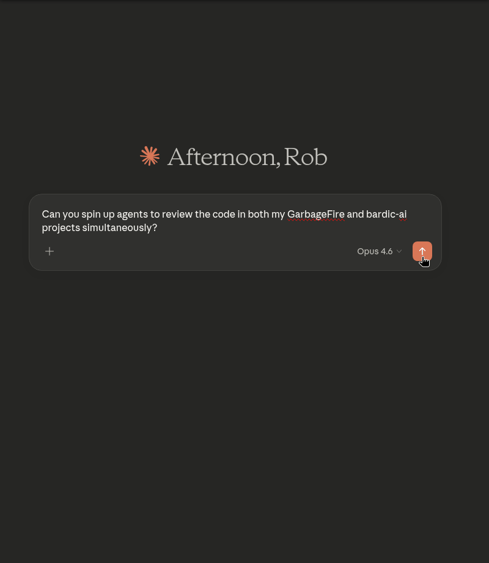

# 🪖 ClaudeArmy

  

An MCP server that lets Claude orchestrate multiple Claude Code agents working autonomously across different projects.



## What It Does

ClaudeArmy gives Claude (in the chat interface) the ability to spawn background Claude Code processes that work independently on coding tasks. Think of it as a chain of command:

- **You** → give strategic direction
- **Claude (chat)** → breaks it down and dispatches agents
- **Claude Code agents** → execute autonomously, spawning their own sub-agents as needed

This means you can kick off work across multiple projects simultaneously, keep chatting normally, and check in on progress whenever you want.

## Tools

| Tool | Description |
|------|-------------|
| `dispatch_task` | Deploy a Claude Code agent to a project directory |
| `check_tasks` | Monitor status of all running/completed agents |
| `get_task_output` | Retrieve what an agent did and its full output |
| `cancel_task` | Stop a running agent gracefully |
| `purge_tasks` | Clean up completed/failed tasks |

## Setup

1. Clone this repo
2. `npm install`
3. Add to your Claude Desktop config (`~/.config/Claude/claude_desktop_config.json`):

```json
"claude-army": {
  "command": "node",
  "args": ["/path/to/claude-army/src/index.js"]
}
```

4. Restart Claude Desktop

## Usage Examples

**Single project task:**
> "Refactor GarbageFire's app.py into modular components"

**Multi-project parallel work:**
> "Refactor GarbageFire to be more modular, and add a Salesforce adapter to my Reporting Tool"

Claude will dispatch separate agents to each project directory and let them work autonomously.

**Check progress:**
> "How are the agents doing?"

## Configuration

Edit the constants at the top of `src/index.js`:

- `CLAUDE_BINARY` - Path to your Claude Code binary
- `MAX_CONCURRENT_TASKS` - Max simultaneous agents (default: 5)

## Requirements

- Claude Code installed and authenticated
- Node.js 18+
- Claude Desktop or any MCP-compatible client

## Changelog

### v0.3.0
- Fixed stream-json parsing to correctly handle assistant message content arrays
- Staleness indicator: `check_tasks` now shows time since last agent activity
- Better error surfacing: actionable messages for CLI not found, permission denied, and mid-run failures
- Fixed output duplication in `get_task_output`
- Demo GIF added to README

### v0.2.0
- Real-time progress tracking via Claude Code's stream-json output
- `check_tasks` now shows recent agent activity (file reads, edits, bash commands) instead of just runtime
- `get_task_output` includes a full progress timeline with timestamps
- Structured event parsing for tool use, assistant messages, and results

### v0.1.0
- Initial release
- Core tools: dispatch_task, check_tasks, get_task_output, cancel_task, purge_tasks
- Fire-and-forget architecture with background process management
- Max 5 concurrent agents
- stdio transport for MCP communication

## License

MIT
